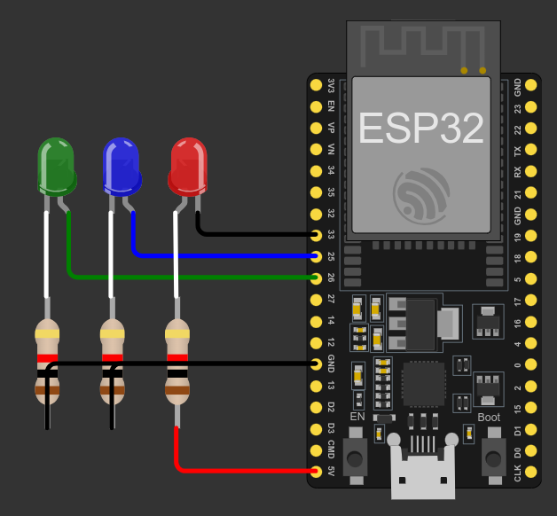

# **TASK 1** LED Controller 
Pada tugas ini dibuat dengan menggunakna konsep dari OOP supaya kode yang dibuat tidak ulang. OOP memungkinkan untuk membuat kode lebih rapi dan bersih dikarenakan OOP mengatur konsep dari _reusable_.

> Task ini dibuat menggunakan PlatformIo.

## Requitments
Terdapat sebuah ketentuan 

|Name|Active Level|Mode|Blink Frequency|
|-|-|-|-|
|LED RED|LOW|Blink,ON,OFF|10 Hz|
|LED GREEN|HIGH|Blink,ON,OFF|5 Hz|
|LED BLUE|HIGH|Blink,ON,OFF|2 Hz|

1.  Buat sebuah program untuk mengontrol ketiga LED tersebut menggunakan
konsep OOP.
2. Setiap LED harus dapat:
    - Menyala (ON)
    - Mati (Off)
    - Berkedip (Blink) sesuai frekuensi masing-masing
3. Program harus menjalankan ketiga LED secara bersamaan dalam mode blink dan
LED harus berkedip independen sesuai frekuensinya.
4.  Output boleh berupa simulasi (misal print ke console), tidak wajib menggunakan
hardware.

## Schematic 

## How to works
Dengan ketentuan diatas didapatkan bahwa LED memiliki active level high dan low. Pada active level <mark>HIGH</mark> maka untuk menyalakan LED diberikan nilai _HIGH_ dan untuk mematikan LED dengan _LOW_. Sebaliknya juga, jika active level <mark>LOW</mark> maka untuk menyalakan LED diberikan nilai _LOW_ dan untuk mematikan LED dengan _HIGH_.

Untuk mengaturan frequency dapat dilakukan menggunakan method setMode dengan argumen LED mode dan frequency 
