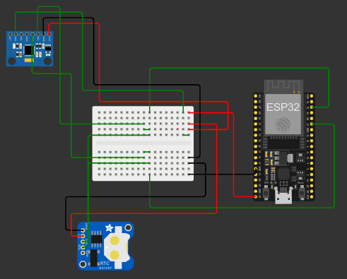

# **TASK 2** LED Controller 
Pada tugas ini dibuat dengan menggunakna konsep dari OOP supaya kode yang dibuat tidak ulang. OOP memungkinkan untuk membuat kode lebih rapi dan bersih dikarenakan OOP mengatur konsep dari _reusable_.

> Task ini dibuat menggunakan PlatformIo.

## Requitments
Terdapat sebuah spesifikasi & constaint dan requirement

Spesifikasi & constraint
---
1. Setiap sensor membutuhkan 40 ms untuk melakukan proses pembacaan data.
2. Kelima sensor menggunakan bus yang sama, sehingga pembacaan harus
dilakukan secara berurutan.
3. Setiap data sensor membutuhkan 40 ms untuk dikirim.
4. Setiap sensor harus mengirimkan data setiap 200 ms dengan toleransi maksimal
5ms.

Requirements
---
1. Buat sebuah program untuk menangani 5 sensor sehingga setiap sensor dapat:
   - Melakukan pembacaan data
   - Mengirimkan datanya dengan interval 200 ms dan tetap berada dalam
batas toleransi.
2. Proses pembacaan data dan pengiriman data tidak boleh menyebabkan sensor
lain melampaui batas toleransi waktu.
3. Program harus memastikan bahwa setiap sensor tetap mengirimkan data sesuai
jadwal meskipun terdapat keterlambatan pada proses baca/kirim.
4. Output boleh berupa simulasi ke console, misalnya log waktu pembacaan dan
pengiriman.

## Schematic 

## How to works

Pada task ini digunkan 2 sensor I2C MPU6050 & RTC, dikarenakna constraint harus memiliki 5 sensor maka dilakukan insiasi sebanyak 5 sensor
