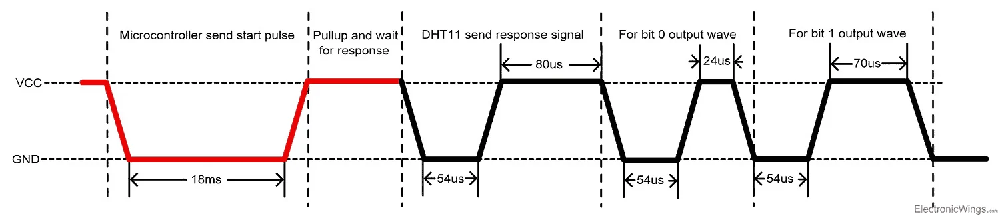
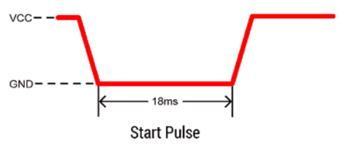
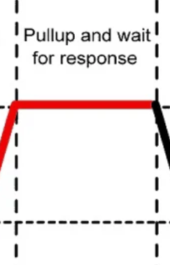
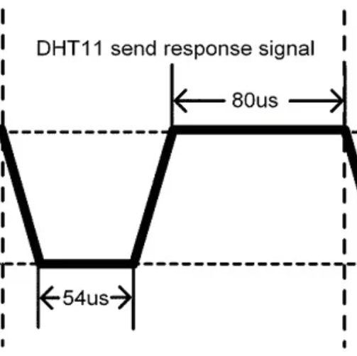

# **TASK 4** Make library DHT11
Pada tugas ini dibuat untuk membuat library pada sensor DHT11.

> Task ini dibuat menggunakan PlatformIo.

## Requitments
Terdapat sebuah requirement

1. Buat sebuah program yang memungkinkan kedua task berjalan secara
bersamaan dan tetap dapat menggunakan sharedDataBuffer dengan aman.
2. Output boleh berupa simulasi ke console, misal :
`Sensor Task: Updating buffer...
Communication Task: Sending data...`

## Schematic 

## How to works
Pada sensor DHT memiliki proses komunikasi seperti gambar berikut:

### Start Pulse (Request)

Untuk berkomunikasi dengan DHT11, diperlukan mengirim sebuah sinyal ke sensor DHT11.
MCU mengirimkan sinyal pull down minimal selama 18ms.

MCU akan menunggu response dari sensor DHT11 dengan sinyal pull up.

### Response 

Setelah melakukan start pulse, untuk menandapakan sensor mendapatkan start pulse sensor akan mengirimkan pull down selama 54us dan pull up 80us

### Data

Setelah mengirimkan response pulse, DHT11 mengirimkan data yang mengandung humadity dan temp bersamaan dengan nilai checksum.

Data yang dikirim akan memiliki panjang 40 bit, yang akan berisikan 5 bagian dan setiap bagian memiliki panjang 8 bit

- Bagian 1 dan 2 akan berisikan nilai dari humadity desimal dan integer.
- Bagian 3 dan 4 akan berisikan nilai dari temp desimal dan integer.
- Bagian terakhir akan berisi dari checksum
- Untuk checksum akan menambahkan bagian 1 sampai 4 dan membandingkan apakah sama atau tidak.